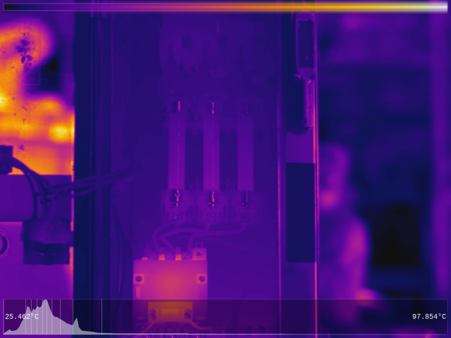
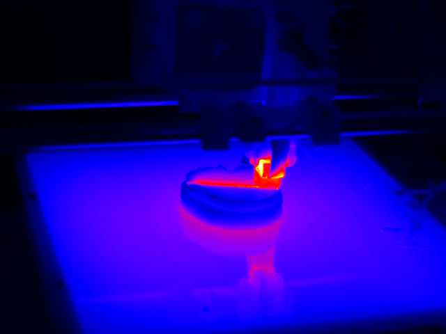

# Java Flir Tools

A Java port of [ExifTool/FLIR.pm](https://github.com/exiftool/exiftool/blob/master/lib/Image/ExifTool/FLIR.pm) - with additional code from [R's Thermimage](https://rdrr.io/cran/Thermimage/src/R/raw2temp.R) (for calculating temperatures).

# Why?

Converting something from one language to another is an interesting challenge - like trying to write in somebody else's style. I find I often end up learning unexpected things about both languages that I may not have otherwise uncovered. It is also a great vehicle for understanding the subject of the code, often because converting a functional library often requires touching every line or function of the program.

In this specific case reading binary data that is difficult to visualize or even sometimes abstractly understand is a great way to improve general development skills.

Also representing the significant amount of offsets and definitions of the file format in a clear / well documented way was an interesting exercise.

# What

The code can read the FFF data format and extract and format raw thermal values, properties, and palette information. There is additional code to extract FFF data from the JPEG format - which is often referred to as a thermal Jpeg.

The library supports temperature data as either raw (16bit big or little endian) or in PNG format.

A demo page with output images can be found here: [https://json-k.github.io/java-flir-tools/](https://json-k.github.io/java-flir-tools/)

# Building & Running

This project has a standard Gradle build - run the Gradle task `jar` (in the `build` group) to output the code.

To generate outputs from a FLIR Thermal Jpeg (a Jpeg file containing an FFF segment): place one of more files (with `.jpg` extension) in the root of the `./samples` directory of the project and run the Gradle `run` task (in the `samples` group). In this case outputs will be written to the project `./build/` folder.

This test / demo code can be found in the java file: `org.keeber.imaging.thermal.Test`.

# Using the Library

Reading a Flir Thermal Jpeg from a stream:

```Java
    FlirImage image = FlirImage.fromJPG(new FileInputStream("./path/to/file.jpg"));
```

Retrieving properties from the parsed image - and accessing the raw values.

```Java
    float transmission = flir.getProperty(FlirFormat.FlirRecord.Camera.Properties.IRWindowTransmission);
    short[] raw = image.getRawValues();
```

The raw values are unsigned shorts - they can be assigned directly as an image buffer of an image (BufferedImage) of type `TYPE_USHORT_GRAY` to create the same image found in the Exiftool output. *Remember when saving this image that not every format support 16bit grey (Tiff being one that does, and Jpeg being one that does not).

Raw vakues can be converted to integers like this:

```Java
    int[] data = IntStream.range(0, image.getRawValues().length).map(i -> Short.toUnsignedInt(image.getRawValues()[i])).toArray();
```

...or the `FlirImage` object has a 'tool kit' for performing common operations on the image:

```Java
    int[] data =  image.getToolkit().getData();
```
## Toolkit

The toolkit has methods for common functions used with thermal images.

Creating images:

```Java
    // A pretty SVG image with colorbar and histogram
    String svg = image.getToolkit().asPrettySVG();
    // An image using the embedded palette
    BufferedImage img = image.getToolkit().asImageDefault();
```



('Pretty' SVG Image)

**The toolkit creates images by 'transforming' the raw data - optionally pinning to min / max values then converting to an RGBA integer that can be used directly as the buffer of a BuffereImage.

...and using an inbuilt palette:

```Java
    // An image generated with a built in palette // with over and under colors 
    Stats stats = image.getToolkit().getStats();
    BufferedImage img = image.getToolkit().asImagePalletted(FlirFormat.Palettes.FAKEBOW, stats.getMax(), stats.getMin(),0x77ff0000,0x770000ff);

```



(Paletted Image (Widebow Pallette))

Getting temperatures (I mean...it *is* a thermal image):

```Java
    double[] temperatures = image.getToolkit().getTemperatures();
```

# TODO

* I was sure this was the correct abstraction from the original Perl - now it's done I'm not so sure.
* The documentation of the offsets / format / etc now seems too much and not enough.
* The properties represenation needs work (does it to be generic in that way?)
* Unit testing, right?